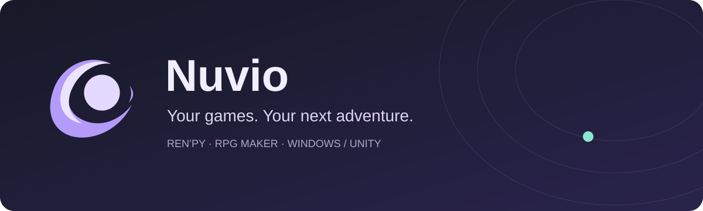
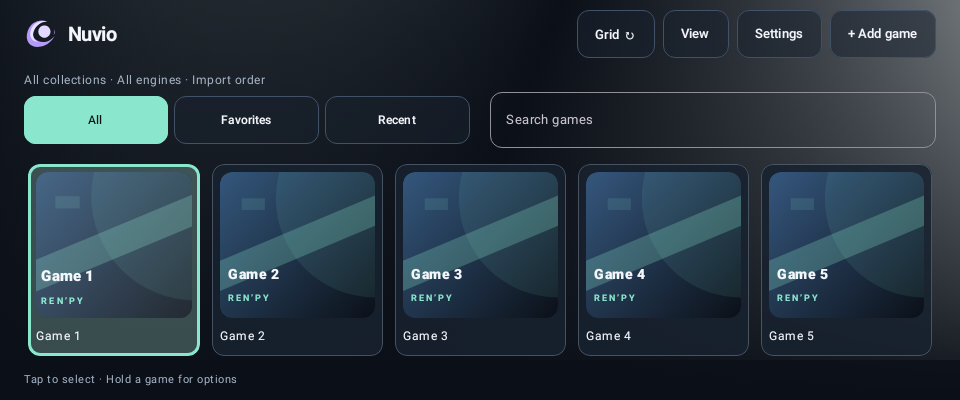

  

  <strong>A home for your visual novels and RPGs on Android.</strong> 
  Built for handheld controllers. Comfortable with touch, too.

  <a href="https://github.com/GhostNoodl/Nuvio/releases">Releases</a> ·
  <a href="CHANGELOG.md">Changelog</a> ·
  <a href="#getting-started">Getting started</a> ·
  <a href="#game-compatibility">Compatibility</a> ·
  <a href="https://github.com/GhostNoodl/Nuvio/issues">Report a bug</a>

> **Nuvio 0.35.8 is available.** [Download the Android APK](https://github.com/GhostNoodl/Nuvio/releases/download/v0.35.8/Nuvio-0.35.8-embedded.apk) · [Release notes, checksums, and sources](https://github.com/GhostNoodl/Nuvio/releases/tag/v0.35.8)

## A shelf that feels like yours

*Actual Nuvio UI rendered in a headless Android test, using placeholder games and artwork. Not an on-device screenshot.*

- **Choose your view.** Cycle carousel, grid, list, and icons from the home screen. Adjust card sizes, show or hide the selected-game panel, and enable quick launch.
- **Organize your collection.** Create collections, mark favorites, browse recently played games, and sort by title, game type, or last played.
- **Bring a whole library.** Batch-import supported game folders or ZIPs. Imported display names shed underscores and version suffixes and separate camel-case words.
- **Make the art fit.** Find covers and backgrounds with VNDB, SteamGridDB, or IGDB, or use local images. Save art offline and choose fit, crop, or stretch independently for each shelf layout.
- **Play your way.** Controller navigation, optional pointers, and movable touch overlays with custom buttons and per-game profiles. Long highlighted titles scroll into view.
- **Set the mood.** Five accent palettes, animated transitions, and a Reduced Motion option.

## Game compatibility

Nuvio brings several runtimes into one app. **Compatibility is game-specific:** importing a game or reaching its title screen does not guarantee that every scene, plugin, or save will work.

| Game type | How it runs | What to expect |
| --- | --- | --- |
| Ren’Py | Bundled Python 2 and Python 3 engine families | Folder and ZIP imports; older and custom-script games can need extra testing. |
| RPG Maker MV / MZ | The game’s browser engine | Folder and ZIP imports; desktop-only plugins may not work. |
| RPG Maker XP / VX / VX Ace | An experimental mkxp-z-based runtime, with MIDI support | Requires 64-bit Android 11+. Desktop DLL plugins are unsupported. |
| Windows / Unity | An experimental built-in Wine / Box64 runtime | Automatic setup from extracted folders, with advanced container options. Hardware, graphics drivers, and game requirements matter. This does not run every Windows game. |

Nuvio has been playtested on the **AYN Odin 3**. Other phones and handhelds need testing; touch support does not imply universal hardware compatibility. Android 11+ with a 64-bit device is the practical starting point for the full set of engines.

**No games are included.** Bring game files you’re entitled to use. Game content and artwork belong to their respective owners.

## Getting started

Start with the [latest release](https://github.com/GhostNoodl/Nuvio/releases/latest):

1. Download the Nuvio APK from [Releases](https://github.com/GhostNoodl/Nuvio/releases) and install it. Android may ask you to allow installation from your browser or file manager.
2. Open **Add game**. Choose a folder or ZIP for Ren’Py / RPG Maker, or **Windows / Unity** for automatic setup of an extracted Windows game.
3. Choose artwork, then tap a game or select it with your controller to play. Long-press a shelf entry for game options.
4. Open the player’s back menu for controls, keyboard, touch-overlay options, and returning to the shelf. **Save in the game before leaving.**

For several games, open **View → Import several games**. Folder scanning can discover multiple supported games under a parent folder. ZIP batches support Ren’Py / RPG Maker, one game per archive; Windows batches use extracted folders.

### Artwork and controls

**Settings → Artwork** selects an artwork provider. VNDB public search needs no personal key; SteamGridDB uses your API key; IGDB uses your Twitch developer credentials. Enter credentials only inside Nuvio. Bulk artwork lookup fills missing art and leaves ambiguous matches for you to choose.

**Settings → Library** controls the shelf and each layout’s cover display. Individual game options let you adjust cover framing. Touch controls can be moved and customized, with profiles for individual games. Controller prompts hide when no controller is detected.

### Storage, saves, and updates

- Folder imports can use original files directly. ZIP imports let you choose internal storage or an external destination; batch ZIP imports use internal storage.
- **Settings → Storage** shows app-owned data and cleanup options. Uninstalling Nuvio removes private data, including internal imports and saves: export important saves first.
- Nuvio provides save backup tools for its Ren’Py and RPG Maker players. **Windows saves live in the container or game folder and are not included in those backups.**
- Startup update checks notify you when a newer compatible stable GitHub release is available. You can also check manually in **Settings → About**. Install updates over your existing copy; don’t uninstall first.

## Help improve Nuvio

Found a broken map, awkward control, or stubborn import? [Open a bug report](https://github.com/GhostNoodl/Nuvio/issues/new/choose) with your Nuvio version, device, game engine/version, and steps to reproduce it.

You can export a report from **Settings → Setup, device checks & bug reports**. Review attachments before posting and remove personal information. Please don’t upload game files, saves, credentials, or private download links.

Have an idea? Use the feature-request template. More devices and focused compatibility reports are especially welcome.

## Built on good company

Nuvio is a native Kotlin / Jetpack Compose app. Its engine integrations build on work from **Ren’Py, mkxp-z, FluidSynth, Wine, Box64, Winlator**, and their dependencies. Artwork services include **VNDB, SteamGridDB, and IGDB**. Nuvio is an independent project and is not endorsed by those projects or services.

Original Nuvio code and documentation use the [MIT license](LICENSE). Third-party components retain their own licenses; MIT does **not** relicense the combined runtime. Release source archives and component notices are attached to each release. This repository currently serves as the release landing page, rather than the complete development checkout.
